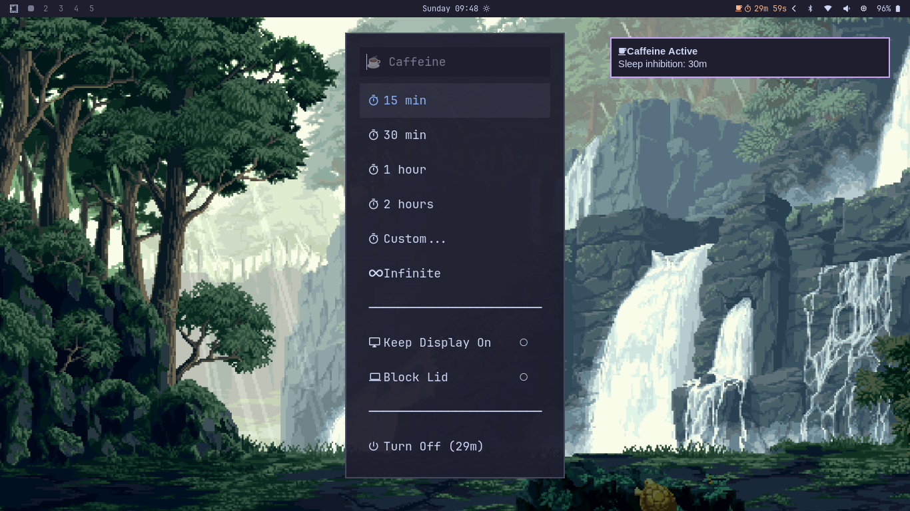

# HyprCaffeine ☕

> Idle inhibition utility for Hyprland — caffeine for your Wayland compositor

[](https://github.com/hbuddenberg/hyprcaffeine/releases)
[](LICENSE)
[](https://www.gnu.org/software/bash/)
[](https://github.com/hyprwm/Hyprland)

Control sleep inhibition, keep display on, and block lid-close — all independent toggles. Features a Walker launcher menu, Waybar integration, Hyprland keybindings, and desktop notifications.



[Report a Bug](https://github.com/hbuddenberg/hyprcaffeine/issues) ·
[Request a Feature](https://github.com/hbuddenberg/hyprcaffeine/issues) ·
[Contribute](https://github.com/hbuddenberg/hyprcaffeine/pulls)

---

## Features

- **⏱ Timer/Infinite** — Block suspend for N minutes or forever (independent)
- **🖥 Keep Display On** — Block dim, DPMS, and lock (persistent across reboots)
- **💻 Block Lid** — Inhibit lid-close suspend (needs polkit)
- **🔔 Desktop Notifications** — `notify-send` alerts on every toggle (monitor, lid, idle)
- **📋 Walker Menu** — Beautiful Catppuccin-themed launcher with toggle UI
- **🔌 Waybar Module** — Visual status with auto-setup
- **⌨️ Keybindings** — Pre-configured Hyprland hotkeys for instant control

---

## Keybindings (v0.7.4+)

| Shortcut | Action |
|---|---|
| `SUPER + CTRL + I` | Toggle infinite idle (on/off) |
| `SUPER + CTRL + SHIFT + I` | Show Walker menu |
| `SUPER + CTRL + SHIFT + D` | Toggle lid inhibit |
| `SUPER + CTRL + D` | Toggle monitor keep-awake |

Auto-installed via `hyprcaffeine keybinds install`. Creates `~/.config/hypr/hyprcaffeine-keybinds.conf` sourced from `hyprland.conf`.

---

## Installation

### AUR (recommended)

```bash
yay -S hyprcaffeine
```

### Manual

```bash
git clone https://github.com/hbuddenberg/hyprcaffeine.git
cd hyprcaffeine
./install.sh
```

---

## Usage

```bash
hyprcaffeine                    # Interactive menu (requires gum)
hyprcaffeine on [duration]      # Block suspend (30m, 2h, infinite)
hyprcaffeine off                # Stop inhibit
hyprcaffeine toggle             # Toggle on/off (infinite)
hyprcaffeine status             # Show all states
hyprcaffeine menu               # Walker launcher menu
hyprcaffeine monitor on|off|toggle  # Keep display on
hyprcaffeine lid on|off|toggle      # Block lid-close
hyprcaffeine keybinds install|remove|status  # Manage hotkeys
hyprcaffeine waybar             # Waybar JSON status
hyprcaffeine waybar-setup       # Setup waybar integration
hyprcaffeine watcher start|stop # Auto-activation daemon
```

---

## Waybar Integration

```bash
hyprcaffeine waybar-setup       # Smart setup (detects existing config)
hyprcaffeine waybar-setup --force  # Re-create from scratch
```

Adds a custom module `custom/hyprcaffeine` to your waybar with adaptive colors:
- ☕ Gray — Inactive
- ☕ Orange — Timer or infinite mode
- ☕ Green — With monitor keep-awake
- ☕ Pink — With lid inhibit
- ☕ Red — All features active

---

## Walker Menu

Requires `walker` (AUR: `walker`) and the Catppuccin caffeine theme:

```bash
hyprcaffeine menu
```

Menu options:
- Toggle idle (infinite or timed)
- Toggle monitor keep-awake
- Toggle lid inhibit
- Quick duration presets (15m, 30m, 1h, 2h)

---

## Configuration

Edit `~/.config/hyprcaffeine/config.yaml` (auto-created from defaults):

```yaml
keybinds:
  enabled: true
  toggle_infinite: "$mainMod CTRL, I"
  menu: "$mainMod CTRL SHIFT, I"
  toggle_lid: "$mainMod CTRL SHIFT, D"
  toggle_monitor: "$mainMod CTRL, D"

timeouts:
  default: 1800  # 30 minutes
  presets: [900, 1800, 3600, 7200]

notifications:
  enabled: true
  expire_warning: 60
```

---

## License

MIT
